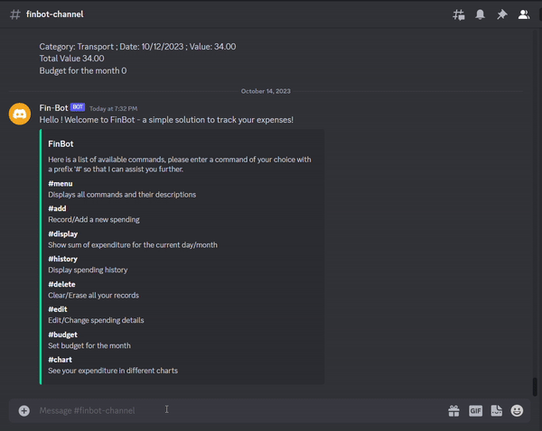
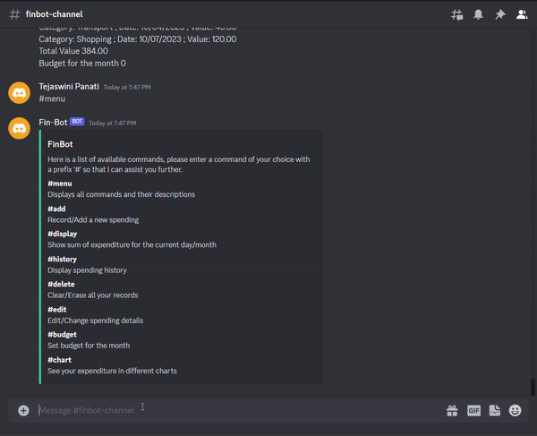
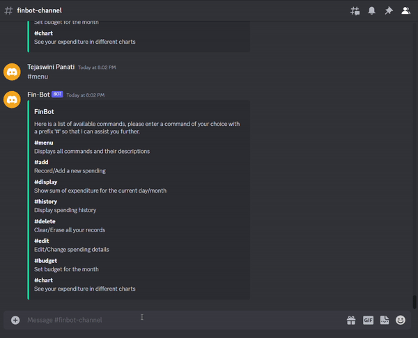
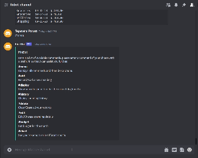
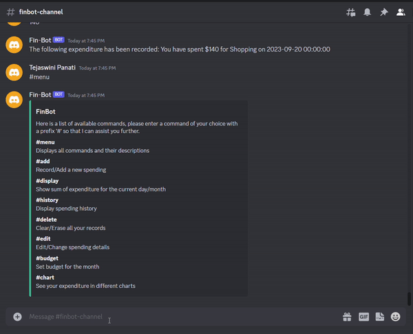
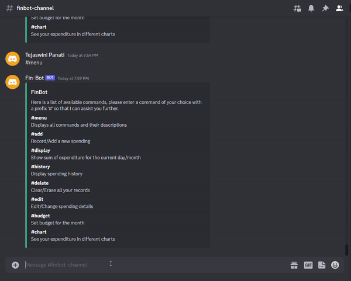

<hr>


[](https://zenodo.org/badge/latestdoi/431190543)
[](https://desktop.telegram.org/)
[](https://discord.com/)
[](https://app.codecov.io/gh/vyshnavi-adusumelli/FinBot/)
[](https://github.com/vyshnavi-adusumelli/FinBot/actions)


<hr>

# FinBot - Because your financial future deserves the best!

You wake up, brew a fresh cup of coffee, and start your day. You're excited because today is the day you take control of your finances like never before. How? Say hello to FinBot, your ultimate financial companion. With simple commands, it transforms your financial story into one of motivation, empowerment, and control. 

And the best part? FinBot is your multi-platform financial sidekick, available on both Discord and Telegram. That means no matter where you are, it's there to assist you in recording your expenses seamlessly.
<hr>
<p align="center">
<a></a>
</p>
<hr>

## Demo Video

https://www.youtube.com/watch?v=LkZGFGU5B6I

## :money_with_wings: About FinBot

FinBot is a user-friendly Telegram and Discord bot designed to simplify your daily expense recording on a local system effortlessly. By offering the bot on two popular messaging platforms, we tap into a larger and diverse user base, increasing the potential reach of the service and enhancing user experience. 
<p align="center">
<a></a>
</p>


With simple commands, this bot allows you to:

📝 **Add/Record a new spending:** As you sip that morning coffee, effortlessly log your expenses, no matter how small or significant. Every expense adds up, and FinBot ensures you don't miss a thing.

💡 **Display your expenditure for the current day/month:** With FinBot, you're never in the dark about your spending. Get real-time insights on your daily and monthly expenses, motivating you to stay on budget and crush your financial goals.

🔍 **Show your spending history:** Ever wondered where your money disappears to? FinBot provides a detailed spending history that tells a story of your financial habits. It's a tale of lessons and opportunities for improvement.

🗑️ **Delete/Erase all your records:** Made an error or just want to start afresh? It's as simple as a command, a chance to correct your narrative without any hassle.

🔧 **Edit/Change any spending details:** Life is full of surprises, and sometimes expenses change. FinBot adapts with you, offering easy editing options to keep your story accurate.

📊 Set Your Budget: Take full control of your finances by defining and tracking your budget with FinBot. It's the proactive step that puts you firmly in the driver's seat of your financial journey.

📈 **Visualize your spending:** Numbers can be daunting, but FinBot transforms them into a captivating visual experience. Use the '/chart' option to see your spending as graphs and pie charts. This punchline to your story helps you spot trends and make smarter financial choices.

# :star: What's New?

- **Multi-Platform Functionality:** With our latest update, FinBot is no longer limited to Telegram; we've extended its capabilities to Discord as well, providing you with a seamless multi-platform experience.
- **Unified User Experience:** Whether you prefer Telegram or Discord, you can now enjoy the same user-friendly experience for recording your daily expenses, managing your budget, and more.
- **Cross-Platform Expense Recording:** You can now add/record new spending, view your expenditure for the day/month, display your spending history, and edit/change spending details on both Telegram and Discord.
- **Data Visualization:** Our data visualization feature is now available on both platforms. Use the '/chart' (Telegram) or '#chart' (Discord) option to visualize your expenses in the form of graphs and pie charts, gaining deeper insights into your spending habits. Further in Discord, the bot supports the start and end dates within which the visuals can be viewed enabling customization.

<!-- [comment]: <> (## Demo) -->

<!-- [comment]: <> (https://user-images.githubusercontent.com/15325746/135395315-e234dc5e-d891-470a-b3f4-04aa1d11ed45.mp4) -->

# :rocket: Installation Guide

## 💻For developers 
1. Install Python, atleast Python3

2. Clone this repository to your local system at a suitable directory/location of your choice

3. Start a terminal session, and navigate to the directory where the repo has been cloned

4. Run the following command to install the required dependencies:
```
  pip install -r requirements.txt
```
5. Ensure that you export the PYTHONPATH variable to the main project folder in the environment variables. This is essential for your Python scripts to locate and import the project modules correctly.

### Telegram Setup
1. Begin by downloading and installing the Telegram desktop application for your system from the official website: [Telegram Desktop](https://desktop.telegram.org/).

2.  Log in to your Telegram account. In the Telegram app, search for "BotFather." Click on "Start" to initiate a conversation with BotFather. Enter the following command: /newbot

3.  Follow the on-screen instructions to choose a name for your bot. After naming your bot, select a username for your bot, which should end with "bot" (as instructed in the Telegram interface).

4.  Once you've configured your bot, BotFather will confirm the creation and provide you with an API TOKEN. Copy this token for future use.

5.  In the Telegram app, search for your newly created bot by entering its username. Open the bot's chat to access its details.

6.  Right-click on the chat with your bot in the Telegram app. Copy the chat's ID as CHAT_ID for future reference.

7.  Set both the CHAT_ID and API_TOKEN as environment variables on your computer. These variables are essential for your bot to interact with Telegram.

8.  Open your terminal and navigate to the project's root folder. Run the command: ```python src/TeleBot.py``` in the terminal. A successful run will generate a message in your terminal, indicating that "TeleBot: Started polling."

9.  After a successful run, go to your bot on Telegram. Enter the "/start" or "/menu" command to initialize your bot, and you're all set to track your expenses!

### Discord Setup

1. Start by downloading and installing the Discord desktop application for your system from the following official website: [Discord Download](https://discord.com/download).

2. Visit the [Discord Developer Portal](https://discord.com/developers/applications) and create a new application. Follow the steps in this guide to create your Discord bot: [Creating Your First Bot](https://guide.pycord.dev/getting-started/creating-your-first-bot).

3. Give your bot a unique name and customize its avatar. Important: Ensure that your bot's name does not include "Discord." Applications with "Discord" in their name may not function correctly.

4. Once you've created your bot, it will be provided with a DISCORD_TOKEN. Make sure to copy this token as you'll need it later.

5. From the Discord Developer Portal, configure your bot with the necessary permissions and rights. This ensures it can interact with servers and channels.

6. Create a server on Discord where your bot will operate. Inside this server, create a dedicated channel for your bot. Copy the CHANNEL_ID of this channel for future reference.

7. Set the DISCORD_TOKEN and CHANNEL_ID as environment variables on your computer. These variables will be used by your bot to connect to the correct server and channel.

8. Open your terminal and navigate to the project's root folder. Run the command: ```python src/DiscordBot.py``` in the terminal. A successful run will generate a message in your terminal, indicating that "Shard ID None has connected to Gateway."

9. After a successful connection, go to your bot on Discord and enter the "#menu" command. Your bot is now ready to track your expenses!

## Testing with Pytest

1. Ensure that all necessary environment variables are correctly set on your computer. These variables are crucial for the functioning of your bot and test environment:

    - DISCORD_TOKEN: Your Discord bot's token.
    - CHANNEL_ID: The ID of the Discord channel your bot operates in.
    - API_TOKEN: The API token for your Telegram bot.
    - CHAT_ID: The ID of the chat where your Telegram bot operates.
    - PYTHONPATH: Set the PYTHONPATH variable to the main project folder. This helps your Python scripts locate and import project modules correctly.

2. Navigate to the FinBot/test/unit folder in your project directory. In your terminal, run the following command:
```
  python -m pytest
```
  After running the tests, you should see a summary indicating the number of test failures and passes.

# :information_desk_person: Use cases

## Discord

### Menu
View all the commands Finbot offers to manage your expenses

<p align="center"></p>

1. This automatically appears when the bot runs.
2. It can be invoked again using `#menu` command.

### Budget
Managing your monthly budget - increase/ decrease

<p align="center"></p>

1. Enter the `#budget` command
2. Enter the new budget amount (must be greater than 0)

### History
View the entire history of the spendings till date

<p align="center"></p>

1. Enter the `#history` command

### Add
Record the money spent on any of the categories as a transaction

<p align="center"></p>

1. Enter the `#add` command
2. Enter the date of the transaction in MM-DD-YYYY format
3. Select the category to add
4. Enter the amount spent

### Delete
Delete a transaction that has been recorded

<p align="center"></p>

1. Enter the `#delete` command
2. Based on what records you want to delete -
   1. Day: enter the day to delete in MM-DD-YYYY format
   2. Month: enter the month to delete in MM-YYYY format
   3. All: enter `All`
3. The records will be displayed. Enter YES to confirm, or NO to cancel

### Edit
Edit or correct a record that has been miss-entered

<p align="center"></p>

1. Enter the `#edit` command
2. Enter the date (MM-DD-YYYY), value, and category of the transaction miss-entered
3. Specify what part of the transaction to edit (either date, category, or value)
4. Enter the new value

### Display
Display the expenditure for the day or for the current month to keep track of your expenses and hence the monthly budget

<p align="center"></p>

1. Enter the `#display` command
2. Select the option - day or month for which you want to view the expenses

### Visualization in the form of graphs
Visualize or track your expenses in the form of bar charts and pie charts

<p align="center"></p>

1. Make sure you have a transaction history.
2. Enter the `#chart` command.
3. Enter the start date in MM-DD-YYYY format.
4. Enter the end date in MM-DD-YYYY format
5. Charts for the spending that fall in this duration will be generated.

## Telegram

### Budget

I want to increase/decrease my monthly budget.

<p align="center"></p>

1. Enter the `/budget` command
2. Enter the new budget amount (must be greater than 0)

### Add

I just spent money and want to mark it as a transaction! 

<p align="center"></p>

1. Enter the `/add` command
2. Click on the date of the transaction
3. Click on the category to add
4. Type in the amount spent

### Delete

Oh no! I entered a transaction but want to delete it! 

<p align="center"></p>

1. Enter the `/delete` command
2. Based on how many records you want to delete..
   1. Per day: enter the day to delete
   2. Per month: enter the month to delete
   3. All: enter All
3. The records will be display. Enter YES to confirm, or NO to cancel

### Edit

Oh no! I entered a transaction but entered the wrong category! 

<p align="center"></p>

1. Enter the `/edit` command
2. Specify the date, category, and value of the transaction
3. Specify what part of the transaction to edit (either date, category, or value)
4. Enter in a new value

### Visualization in the form of graphs

I want to see my spendings in the form of graphs

<p align="center"></p>

1. Make sure you have a transaction history.
2. Enter the `/chart` command.
3. You will see multiple visualizations for your spending 

# :grey_question: Documentation

Thorough documentation of all methods and classes can be found at 

# :construction: Road Map

Our implementation has been tracked in a project board which can be viewed here -
[FinBot Developer board](https://github.com/users/vyshnavi-adusumelli/projects/2)

Some possible future enhancements are as follows:
1.	Generative AI integration with this software 
2.	Category management functionality in Discord.
3.	Convert into a Dockerized application.
4.	Calender widget for discord Bot.


:heart: Acknowledgements
---
We would like to thank Dr. Timothy Menzies for helping us understand the process of building a good Software Engineering project. We would also like to thank the teaching assistants San Gilson, Andre Lustosa, Xueqi (Sherry) Yang, Yasitha Rajapaksha, and Rahul Yedida for their support throughout the project.


:page_facing_up: License
---
This project is licensed under the terms of the MIT license. Please check  for more details.


:sparkles: Contributors
---

<table>
  <tr>
    <td align="center"><br /><sub><b>Harshavardhan Bandaru</b></sub></a></td>
    <td align="center"><br /><sub><b>Vyshnavi Adusumeli</b></sub></a><br /></td>
    <td align="center"><br /><sub><b>Tejaswini Panati</b></sub></a><br /></td>

  </tr>
</table>


# :calling: Support

For any support, email us at vadusum@ncsu.edu
