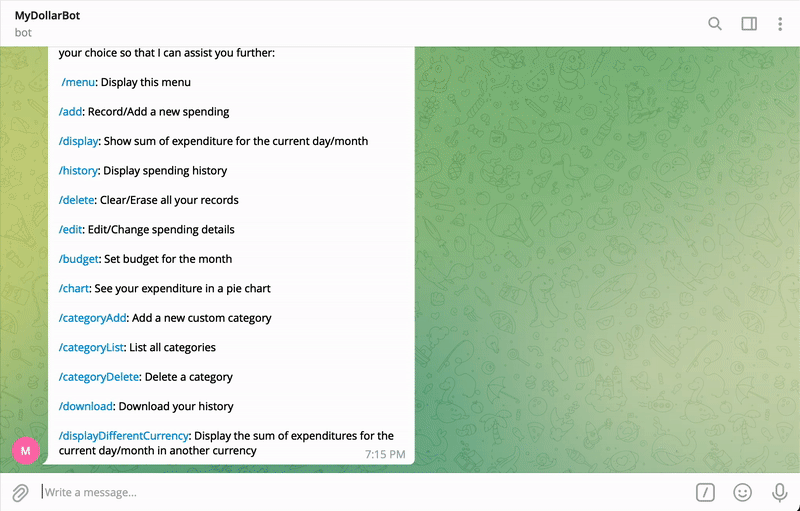
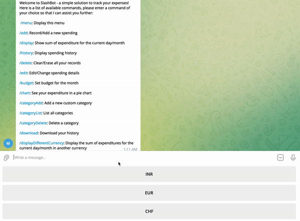

# Changes compared to V2 (MyDollarBot)

The team has worked on multiple facets of the project and has made changes to the code, documentation and overall usability of the original project.

## Functionality
The group has made the below mentioned functional changes to the project improving on the previous work.
1. **Download History:** This version lets you now download your transaction history as a CSV.   

2. **Display total expenditure in different currencies:** This version lets you convert your total daily or monthly expenditure in a different currency.
  

3. **Display Multiple Visualization options:** This version allows you to see your expenses in more than one form of visualization with a template to add more visualizations.
  

4. **Send EMail about the monthly history:** This version allows you to send periodic emails to your account to review your monthly history
  

## Documentation and Testing
Changes to the documentation were also significant. They are mentioned below.
1. **README:** The main README has been updated with new information, more bling and new graphics. More information about testing requirements is added.
2. **Testing:** Resolved bugs from test functions
3. **GIFs for new features:** 4 more gifs are added to the Readme related to new releases in PHASE 3
